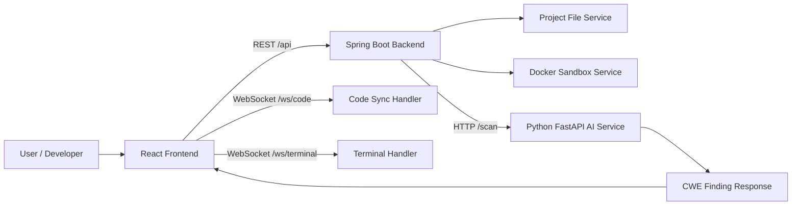

# QLDA - DevSecOps Vulnerability Scanning IDE

QLDA is a project-management and software-engineering capstone repository for a DevSecOps-oriented web IDE. The system combines a React workspace, a Spring Boot backend, a Python AI service, WebSocket-based editor synchronization, and a Docker sandbox concept for safer code execution.

> Planned package milestone: **15/05/2026**  
> Project schedule baseline: **93 working days**, mapped from WBS, AON/CPM and Gantt planning documents.

## Project Vision

The goal is to build an integrated IDE where developers can create projects, edit source code, run code in an isolated sandbox, and request AI-assisted vulnerability scanning. The AI layer returns CWE-oriented findings that are displayed directly in the editor and in a vulnerability detail panel.

This repository contains both implementation scaffolding and project-management artifacts: WBS, risk analysis, effort estimation, AON critical path, Gantt schedule, milestone breakdowns, and module-level source code.

## Core Capabilities

| Area | Capability |
|---|---|
| Project Management | Create projects, inspect project metadata, and manage workspace files. |
| Code Workspace | Display a file tree, edit code, and prepare real-time synchronization through WebSocket. |
| Vulnerability Scanning | Send source code to the AI service and receive CWE findings with severity, line number, message, and confidence. |
| Sandbox Execution | Simulate controlled code execution with CPU, memory, and timeout policies. |
| Terminal Channel | Keep terminal traffic separate from editor synchronization. |
| Reporting | Preserve schedule, risks, milestones, and final handover documents for PBL review. |

## Architecture



## Repository Structure

```text
QLDA/
  ai_service/              Python FastAPI vulnerability scan service
  backend/                 Spring Boot backend, REST APIs, WebSocket handlers
  frontend/                React/Vite IDE interface
  docs/                    Architecture, API, database, use case and milestone docs
  skill/                   Planning skills used for estimation and dependency mapping
  tests/                   Integration smoke tests
  outputs/                 Generated planning output files
  temp/                    Temporary planning artifacts
```

## Module Summary

### Backend - Spring Boot

The backend exposes project APIs, mock file-tree operations, sandbox execution policy, and WebSocket endpoints:

- `GET /api/projects`
- `POST /api/projects`
- `GET /api/projects/{projectId}/tree`
- `POST /api/projects/{projectId}/files`
- `POST /api/projects/{projectId}/run`
- `WS /ws/code`
- `WS /ws/terminal`

Main files:

- `backend/src/main/java/com/ql/Application.java`
- `backend/src/main/java/com/ql/ProjectController.java`
- `backend/src/main/java/com/ql/FileService.java`
- `backend/src/main/java/com/ql/DockerService.java`
- `backend/src/main/java/com/ql/WebSocketConfig.java`

### AI Service - FastAPI

The AI service provides a mock CWE classifier that flags risky patterns such as buffer overflow, SQL injection, and OS command execution.

Main endpoint:

```text
POST /scan
```

Example response:

```json
{
  "projectId": "pbl-devsecops",
  "path": "src/auth.c",
  "language": "c",
  "status": "done",
  "findings": [
    {
      "cwe": "CWE-120",
      "severity": "HIGH",
      "line": 5,
      "message": "Possible classic buffer overflow pattern.",
      "confidence": 0.91
    }
  ]
}
```

### Frontend - React

The frontend provides an IDE-style layout:

- Project dashboard
- File tree
- Source editor
- CWE findings panel
- Terminal panel
- Scan button connected to the AI service

Main files:

- `frontend/src/App.jsx`
- `frontend/src/Dashboard.jsx`
- `frontend/src/components/Editor.jsx`
- `frontend/src/components/FileTree.jsx`
- `frontend/src/components/CWEPanel.jsx`
- `frontend/src/components/Terminal.jsx`

## Planned Timeline

| Month | Work Packages | Focus |
|---|---|---|
| Month 1 | A, B, C, D, E, F, G, K, P | Requirements, CWE scope, architecture, database, UI baseline, initial AI/backend/frontend setup |
| Month 2 | H, I, L, M, N, Q, R | AI model training flow, backend APIs, WebSocket, Docker sandbox, dashboard, file tree |
| Month 3 | J, O, S, T, U, V | AI API, backend-to-AI integration, editor, terminal, CWE panel, unit tests |
| Month 4 | W, X, Y | Integration test, security/performance test, Docker Compose package |
| Month 5 | Z, AA | Trial deployment, final report, architecture handover |

Critical path:

```text
A -> B -> C -> D -> E -> K -> L -> Q -> R -> S -> U -> W -> X -> Y -> Z -> AA
```

## Quick Start

### Run with Docker Compose

```bash
docker compose up --build
```

Services:

| Service | URL |
|---|---|
| Frontend | `http://localhost:5173` |
| Backend | `http://localhost:8080` |
| AI Service | `http://localhost:8000` |

### Run AI Service Locally

```bash
cd ai_service
python -m venv .venv
.venv\Scripts\activate
pip install -r requirements.txt
uvicorn main:app --reload --host 0.0.0.0 --port 8000
```

### Run Frontend Locally

```bash
cd frontend
npm install
npm run dev
```

### Run Backend Locally

```bash
cd backend
mvn spring-boot:run
```

## Project Documents

| Document | Purpose |
|---|---|
| `WBS.md` | Work breakdown structure |
| `bang_uoc_luong_thoi_gian_cong_viec.md` | Effort estimation and risk buffer |
| `lap_lich_bieu_du_an.md` | Project schedule and staffing |
| `so_do_aon_du_an.md` | AON/CPM and critical path |
| `so_do_gantt_du_an.md` | Gantt schedule |
| `thông_tin_rui_ro_dự_án.md` | Risk management table |
| `docs/milestones/` | Month-by-month milestone mapping |

## Team Assignment

| Member | Email | Main Responsibility |
|---|---|---|
| Chung | `lethanhchung1107@gmail.com` | Requirements, architecture, coordination, report |
| Hậu | `hauthanhnguyen1203@gmail.com` | AI, BigVul, CodeBERT/CWE scope, model evaluation |
| Lợi | `loinguyenvan274@gmail.com` | Backend, WebSocket, Docker sandbox, deployment support |
| Thái | `kuakuawtf@gmail.com` | Frontend, UI/UX, terminal/editor integration, testing |

## Current Implementation Status

The repository now includes runnable scaffolding for all major layers. Some components intentionally use mock logic so the full workflow can be demonstrated before replacing mock services with production-grade implementations.

Next engineering steps:

- Replace mock CWE classifier with trained model inference.
- Persist project/file metadata in a database.
- Harden sandbox execution with real container lifecycle management.
- Add frontend test coverage for scan and editor workflows.
- Add CI checks for backend, frontend and AI service.
