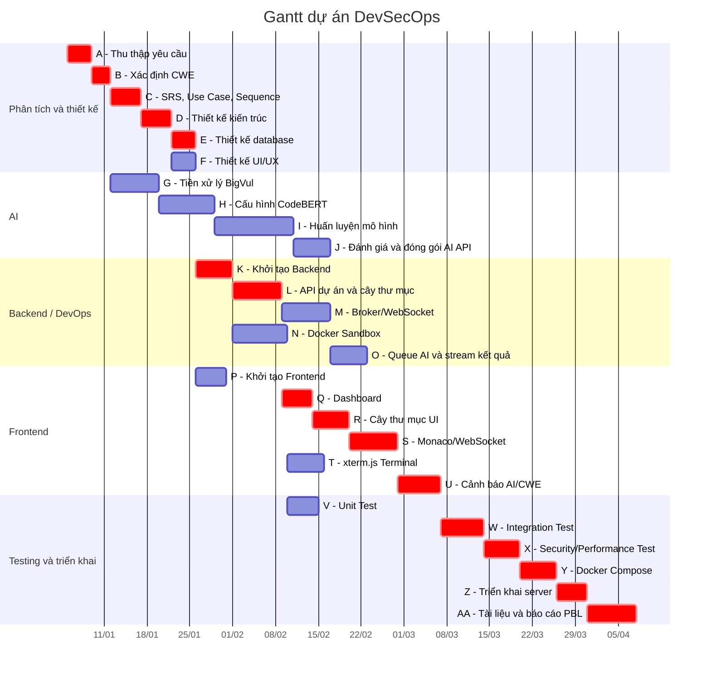

# Sơ đồ Gantt dự án

Quy ước:
* Đơn vị thời gian trong bảng: ngày làm việc.
* Start/Finish dưới đây dùng lịch bắt đầu sớm từ kết quả AON/CPM.
* Công việc có dấu `*` là công việc thuộc đường găng.

## Bảng Gantt theo ngày làm việc

| Ký hiệu | Công việc | Start | Finish | Duration | Công việc trước | Đường găng |
|---|---|---:|---:|---:|---|---|
| A | Thu thập yêu cầu hệ thống từ bài toán DevSecOps | 0 | 4 | 4 | - | * |
| B | Xác định danh mục CWE cần phát hiện | 4 | 7 | 3 | A | * |
| C | Lập tài liệu SRS, Use Case, Sequence | 7 | 12 | 5 | A, B | * |
| D | Thiết kế kiến trúc tổng quan | 12 | 17 | 5 | C | * |
| E | Thiết kế database ERD và cấu trúc lưu trữ | 17 | 21 | 4 | D | * |
| F | Thiết kế UI/UX cho Editor, Terminal, Dashboard | 17 | 21 | 4 | D |  |
| G | Tiền xử lý dữ liệu BigVul | 7 | 15 | 8 | B |  |
| H | Cấu hình CodeBERT và đầu ra đa nhiệm | 15 | 24 | 9 | G |  |
| I | Huấn luyện mô hình AI | 24 | 37 | 13 | H |  |
| J | Đánh giá F1-score và đóng gói AI API | 37 | 43 | 6 | I |  |
| K | Khởi tạo Backend, DB, Entity, JWT/Session | 21 | 27 | 6 | E | * |
| L | Xây dựng API quản lý dự án và cây thư mục | 27 | 35 | 8 | K | * |
| M | Message Broker và WebSocket đồng bộ mã nguồn | 35 | 43 | 8 | L |  |
| N | Docker Client, Sandbox và Terminal I/O | 27 | 36 | 9 | K |  |
| O | Hàng đợi gọi AI Server và stream kết quả | 43 | 49 | 6 | J, M |  |
| P | Khởi tạo Frontend, TailwindCSS, Router, layout IDE | 21 | 26 | 5 | F |  |
| Q | Dashboard quản lý dự án và form tạo mới | 35 | 40 | 5 | P, L | * |
| R | Cây thư mục đệ quy và Context Menu | 40 | 46 | 6 | Q, L | * |
| S | Monaco Editor, auto-complete, đồng bộ WebSocket | 46 | 54 | 8 | R, M | * |
| T | xterm.js và WebSocket riêng cho Terminal | 36 | 42 | 6 | N, P |  |
| U | Cảnh báo AI, highlight lỗi, panel CWE | 54 | 61 | 7 | O, S | * |
| V | Unit Test Backend và Docker Service | 36 | 41 | 5 | L, N |  |
| W | Integration Test Frontend -> AI Server | 61 | 68 | 7 | U, V | * |
| X | Security & Performance Test WebSocket và Docker Sandbox | 68 | 74 | 6 | W | * |
| Y | Kết nối module và đóng gói Docker Compose | 74 | 80 | 6 | X | * |
| Z | Triển khai hệ thống lên server chạy thử | 80 | 85 | 5 | Y | * |
| AA | Hoàn thiện tài liệu kiến trúc và báo cáo PBL | 85 | 93 | 8 | W, Z | * |

## Mermaid Gantt

Ngày bắt đầu minh họa: 2026-01-05. Thời lượng vẫn giữ theo số ngày làm việc đã ước lượng trong lịch.



## Đường găng trên Gantt

```text
A -> B -> C -> D -> E -> K -> L -> Q -> R -> S -> U -> W -> X -> Y -> Z -> AA
```

Tổng thời gian dự án theo đường găng: **93 ngày làm việc**.
